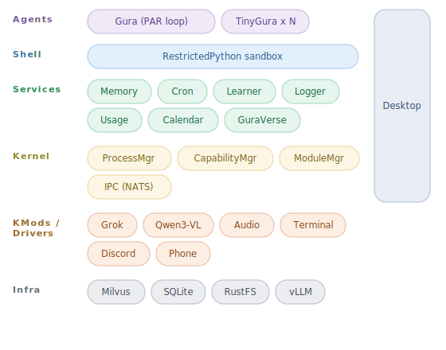

    <h1 align="center">smolGura - AI companion Gura on budget</h1>

## What is smolGura?

smolGura is an emotionally-aware AI companion inspired by the charm and
expressiveness of virtual personalities. She interacts naturally through
text and voice, performs tasks through intelligent reasoning, and learns
from every conversation.

Under the hood, smolGura runs on GuraOS -- a microkernel AI operating system
with a cognitive stack for goal decomposition. TinyGura sub-agents are spawned on
demand from GuraVerse for parallel task handling. Kernel modules and drivers
are hot-pluggable, connecting Gura to terminals, Discord, Android phones,
PCs, and a web dashboard.

Built using [Claude Code](https://claude.ai/claude-code).

## Capabilities

- **Modular** -- kernel modules (LLM, ASR, TTS, vision) and drivers (Terminal, Discord, phone, PC, dashboard) are hot-pluggable
- **Agent spawning** -- GuraVerse registry for spawning TinyGura sub-agents with shared memory
- **Memory** -- automatically memorizes facts about you and recalls them in context
- **Skill learning** -- picks up reusable skills over time, gets better the more you use it
- **Code execution** -- writes and executes Python in a RestrictedPython sandbox
- **Voice chat** -- push-to-talk conversation with voice cloning
- **Vision** -- visual input with image memory; vision kernel modules can add or enhance visual capabilities for any LLM
- **Web search** -- API-based search and page extraction, or browse like a human via computer use / phone use
- **Dashboard** -- React web UI with real-time monitoring, chat, memory browser, GPU status

## Architecture

## Repositories

| Repository | Description |
|------------|-------------|
| [smolGura](https://github.com/smolGura/smolGura) | GuraOS -- the core operating system |
| [Gura-Android](https://github.com/smolGura/Gura-Android) | smolGura terminal for Android |
| [fish-tts](https://github.com/smolGura/fish-tts) | Standalone TTS using DualARTransformer and DAC vocoder |
| [luxtts-onnx](https://github.com/smolGura/luxtts-onnx) | Lightweight ONNX Runtime inference for LuxTTS |
| [tuna](https://github.com/smolGura/tuna) | A Fine-Tuna for our SAME Chan |

## Credits

| Component | Author | License |
|-----------|--------|---------|
| [Smol(ler) Gura](https://sketchfab.com/3d-models/smoller-gura-gawr-gura-holomyth-3329b7c37a694fd19295e7f68d3471f8) 3D model | [Seafoam](https://sketchfab.com/seafoam) | CC-BY-NC |
| [Fish-Speech](https://github.com/fishaudio/fish-speech) TTS | Fish Audio / 39 AI, INC. | Fish Audio Research License |
| [LuxTTS](https://github.com/ysharma3501/LuxTTS) TTS | Yatharth Sharma | Apache-2.0 |
| [FunASR](https://github.com/modelscope/FunASR) ASR | Alibaba DAMO Academy | MIT |

## Special Thanks

- [Gawr Gura](https://hololive.hololivepro.com/en/talents/gawr-gura/) -- for bringing us joy and companionship
- [Walfie](https://twitter.com/walfieee) -- for creating the iconic smol Gura character design
- [Hololive / COVER Corp.](https://hololivepro.com/) -- for the amazing VTuber community

## License

CC-BY-NC-SA-4.0. See [LICENSE](https://github.com/smolGura/smolGura/blob/main/LICENSE) for details.

This project is a non-commercial fan work. The Gawr Gura character and related
assets are the property of COVER Corporation. Usage follows
[Hololive Fan Work Guidelines](https://hololivepro.com/en/terms/).
